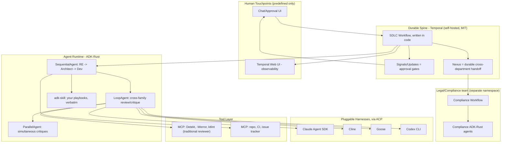

# Software Factory: Landscape Survey & Recommended Architecture

**Research date:** July 8, 2026 (see note below on dating)
**Author:** GitHub Copilot CLI (Claude Sonnet 5), based on three independent research passes against primary sources (official repos, docs, release notes), cross-checked against `software_factory.md` and `software_factory/Mistral.md`.

**Dating note:** this research was requested "as of July 2027," but was actually performed on 2026-07-08 (the system date at research time). Every fact below is anchored to that date. If significant time has passed since, re-verify version numbers and governance status before relying on them — this field moves fast enough that a year is a long time.

---

## 1. Requirements recap

For traceability, the software factory must:

- Run **autonomously**, with human interaction only at predefined points (no interactive IDE/MCP permission prompts during a run).
- Support **feedback loops** where agents from different model families review, critique, and potentially redo each other's work before a human ever sees it.
- Support **hand-offs** between teams of agents (e.g., a "boss" agent routing work from a developer team to a legal/compliance team).
- Provide **hooks for traditional static-analysis tools** (Detekt, compiler warnings-as-errors, etc.), wrapped in scripts, acting as a "traditional reviewer" alongside AI reviewers.
- Be controlled by a **harness** per agent (like Claude Code, Kilo Code, Antigravity) — ideally with a choice of harness per agent, so the same LLM can be run under different harnesses.
- Load each agent's role from a **steering file** (the existing playbooks: requirements engineering, solution architecture, software development).
- Offer a **chat interface** so agents (e.g., the requirements engineer) can interview the user.
- Optionally provide a **GUI** for configuring workflows/feedback loops (nice-to-have, not required).
- Run the **workflow engine and harnesses locally**; LLMs may be called remotely.
- Nice-to-haves: open-source components, multi-vendor LLM support (incl. OpenRouter and local models), Rust-grade performance, and **no enforced workflow or coding style** — full user control over each agent's behavior.

---

## 2. Verdict

**No single existing product satisfies the full requirement set.** The individual pieces, however, are considerably more mature than they were even a year ago. `ADK-Rust` in particular is close to a purpose-built answer for the agent-runtime layer, but a genuine "software factory" still requires composing 4–5 best-of-breed components: a durable workflow engine, an agent-runtime framework, one or more pluggable harnesses, a tool-hook mechanism, and an interop protocol for cross-team hand-off.

---

## 3. Landscape survey

### 3.1 Durable workflow / orchestration engines (the "spine")

| Engine | Language / License | Durable HITL pause | Self-hosted / local | Built-in AI-agent support | Visual GUI | Cross-team handoff |
|---|---|---|---|---|---|---|
| **Temporal** | Server: Go, MIT. `sdk-core`: **Rust**, but the Rust SDK is *Public Preview*, not GA | ✅ Signals / Updates / Queries | ✅ `temporal server start-dev`, zero external deps | ❌ none — AI logic lives in your own Activities | ❌ code-only (Web UI is monitoring-only) | ✅ **Nexus** — durable, observable, cross-namespace, can wait up to 60 days |
| **Camunda 8 / Zeebe** | Zeebe engine: Java, **Camunda License v1 — source-available, NOT OSS**; production requires a paid Enterprise license | ✅ BPMN User Tasks, mature | ⚠️ self-hostable, but production needs the Enterprise license | ✅ **AI Agent connector + ad-hoc sub-processes** (since 8.7, Mar 2025) — the LLM dynamically picks the next BPMN activity | ✅ Desktop Modeler (MIT, free) / Web Modeler (proprietary) | ✅ BPMN pools / sub-processes |
| **LangGraph (OSS)** | Python/TS, MIT | ✅ `interrupt()`, indefinite pause | ✅ fully | ✅ native, AI-first design | ⚠️ Studio = debugging/tracing, not authoring | ⚠️ subgraphs (same process only) |
| **Microsoft Agent Framework (MAF)** | Python/C#, OSS — successor to AutoGen (now maintenance-mode) | ✅ built-in, with checkpointing + **time-travel** | ✅ | ✅ native, graph-based (sequential / concurrent / handoff / group) | ⚠️ declarative YAML, no GUI | ✅ A2A native |
| **n8n** | TS, Sustainable Use License (source-available) | ⚠️ basic (webhook-driven Wait node, not event-replay) | ✅ | ✅ mature AI Agent node (LangChain.js-based) | ✅ best-in-class drag-and-drop canvas | ⚠️ sub-workflows only |
| Prefect | — | — | — | Pivoted to **Horizon**: MCP *governance/observability* for agent identities (suspend/revoke, tool-level access control), not orchestration | — | — |
| Dagster | — | — | — | Stayed data-pipeline/asset focused (Dagster Compass, Databricks integration); no AI-agent-orchestration pivot found | — | — |

**Sources:** github.com/temporalio/temporal, github.com/temporalio/sdk-rust, docs.temporal.io/nexus, docs.camunda.io/docs/reference/licenses, docs.camunda.io/docs/components/agentic-orchestration, docs.langchain.com/oss/python/langgraph, github.com/microsoft/agent-framework, docs.n8n.io, prefect.io/blog/ai-agent-representation-comes-to-horizon (24 Jun 2026).

### 3.2 Rust "agent zoo" (developer libraries — building blocks, not complete harnesses)

| Project | License | Orchestration | MCP | OpenRouter / Local | HITL | Steering files | Verdict |
|---|---|---|---|---|---|---|---|
| **[ADK-Rust](https://github.com/zavora-ai/adk-rust)** | Apache 2.0 | ✅✅ Sequential / Parallel / **Loop** / Graph agents, **native A2A v1.0.0**, **ACP** (wraps Claude Code / Codex / Kiro CLI as sub-agents) | ✅ + elicitation | ✅ + embedded mistral.rs | ✅ `ToolConfirmationPolicy` pause/resume | ✅ `adk-skill` crate (markdown, like CLAUDE.md) | **v1.0.0 stable, 39 crates, 1,938 tests, public playground, 130K+ downloads/6mo. The standout.** |
| **[Rig](https://rig.rs)** | MIT | ❌ library only | ✅ (tool servers, client-side) | ✅ 20+ providers | ❌ | ❌ | Solid provider-abstraction foundation, not an orchestrator. Pre-1.0, frequent breaking changes. |
| **[Octomind](https://github.com/Muvon/octomind)** | Apache 2.0 | ✅ specialist "taps," guardrails-**as-code** instead of modal approval | ✅ dynamic (enable/disable mid-session) | ✅ (OpenRouter explicit) | ⚠️ policy-based, not per-action | ✅ TOML "tap" files | Great "traditional reviewer" philosophy; opinionated CLI runtime, v0.29 |
| **[AutoAgents](https://github.com/liquidos-ai/AutoAgents)** | unclear | ✅ typed pub/sub | ❌ | ✅✅ embedded llama.cpp/mistral.rs (true offline, in-process) | ❌ undocumented | ❌ | Best if you need air-gapped/offline agents |
| **[GraphBit](https://github.com/InfinitiBit/graphbit)** | Apache 2.0 | ✅ graph nodes, parallel execution | ❌ | ✅ (incl. Ollama) | ❌ | ❌ | Rust core, but **Python-facing API** (PyO3) — doesn't satisfy a Rust-first preference |
| **[rs-graph-llm](https://github.com/a-agmon/rs-graph-llm)** (`graph-flow` crate) | unclear, unstated | partial (fan-out only) | ❌ | ✅ via Rig | ✅ genuinely novel native `WaitForInput` | ❌ | Solo-maintainer, v0.5 on crates.io, **no tagged GitHub releases** — reference design only, not production-vetted |
| **[Goose](https://github.com/aaif-goose/goose)** | Apache 2.0 | ⚠️ single-agent + ACP delegation | ✅✅ 70+ extensions | ✅ 15+ providers | ⚠️ unclear per-action gating | ✅ AGENTS.md | See governance note below |
| **[OpenHarness](https://github.com/HKUDS/OpenHarness)** | MIT | ✅ git-worktree-isolated multi-agent teams | ✅ (HTTP transport) | partial | ✅✅ interactive approval dialogs | ✅✅ CLAUDE.md (best of the eight evaluated) | **Python, not Rust.** v0.1.7, academic origin (HKUDS), too young for production — excellent reference architecture |

**Governance note on Goose:** it was **donated by Block, Inc. to a new Linux Foundation body, the Agentic AI Foundation (AAIF)**, which also now hosts MCP, AGENTS.md, and agentgateway. Founding Platinum members: AWS, Anthropic, Block, Bloomberg, Cloudflare, Google, Microsoft, OpenAI. `github.com/block/goose` now 301-redirects to `github.com/aaif-goose/goose`. This is a meaningful neutrality/governance upgrade if vendor-neutral, foundation-backed tooling matters to you.

### 3.3 Harnesses (interactive/headless coding agents — analogous to Claude Code)

| Harness | Language | Multi-vendor (OpenRouter/local) | Truly headless (no prompts) | MCP | Steering file | Multi-agent |
|---|---|---|---|---|---|---|
| **Claude Agent SDK** | TS/Python | ❌ Claude-only (Bedrock/Vertex/Azure backends still all serve Claude) | ✅ `permissionMode: acceptEdits / bypassPermissions` | ✅ | CLAUDE.md (hierarchical) | ✅ subagents (`AgentDefinition`) + hooks |
| **OpenHands (Agent Canvas)** | Python/TS, MIT | ✅ runs Claude Code / Codex / Gemini / its own agent / any **ACP**-compatible agent under one control plane | ✅ headless mode is *always* auto-approve (cannot be changed) | ❓ unconfirmed in docs | partial (microagents; docs reorganized) | ✅ (ACP) |
| **Cline** | TS, Apache 2.0 | ✅✅ broadest — incl. Ollama, LM Studio, 200+ via OpenRouter | ✅ `--yolo` | ✅ | `.clinerules` | ✅ teams + Kanban board |
| Roo Code | TS | — | — | — | — | **❌ Shut down 15 May 2026.** Community fork "ZooCode" exists. Do not build on it. |
| **Kilo Code** | TS, Apache 2.0 | ✅ 500+ models via Kilo Gateway | ⚠️ CLI exists, headless depth unconfirmed | ✅ MCP Marketplace | custom modes (Architect/Coder/Debugger) | ❓ unconfirmed |
| **Aider** | Python, MIT | ✅✅ via LiteLLM — virtually every provider | ✅ `--yes --lint-cmd --test-cmd` | ❌ | CONVENTIONS.md | ❌ single-agent only |
| Gemini CLI | TS, Apache 2.0 | ❌ Gemini-only | ✅ `-p` flag | ✅ | GEMINI.md | ❓ |
| AWS Kiro | proprietary, Electron/VS Code-based | ⚠️ Claude only | **❌ desktop IDE only, no headless mode** | ✅ | `.kiro/agents/` + hooks | experimental (Agent Focus) |
| OpenAI Codex CLI | **Rust binary**, Apache 2.0 | ❌ OpenAI-only | partial | ❓ | — | ❌ |
| **Microsoft Agent Framework** | Python/C#, OSS | ✅ | ✅ | ✅ | via system prompt | ✅✅ graph workflows |

⚠️ **"Google Antigravity":** research could not independently confirm a shipped product under this exact name as of July 2026. Google's verified public agentic-coding offerings are **Gemini CLI** (open source, headless, Gemini-only) and **Jules** (cloud-only async agent, not self-hostable). Product names shift fast in this space — if you have hands-on experience with something called Antigravity, trust that over this research; it may have been renamed or reorganized.

### 3.4 Interop protocols — the three-layer stack that matters

| Layer | Protocol | Governance | Status |
|---|---|---|---|
| Client ↔ Agent | Agent Protocol | Community (AutoGPT lineage) | Stable spec, moderate adoption |
| **Agent ↔ Tools** | **MCP** | "Model Context Protocol, a Series of **LF Projects, LLC**" (neutral, individual-based maintainer governance — not full Linux Foundation membership) | Apache 2.0 code / CC BY 4.0 docs. Confirmed adopters: Anthropic, OpenAI, Microsoft/VS Code, Camunda, n8n, Cursor. Google/AWS direct client support **not confirmed** in primary sources. |
| **Agent ↔ Agent** | **A2A** | **Donated to the Linux Foundation proper** (`a2aproject/A2A`, migrated from `google/A2A`) | Apache 2.0. Primitives: Agent Card (capability discovery), Task (lifecycle spanning hours-to-days), Message, Artifact. Broad adopters: Salesforce, SAP, ServiceNow, Workday, IBM, Atlassian, Box, Cohere, LangChain, MongoDB, PayPal, and the major consultancies. |
| Agent ↔ different harness | **ACP** (Agent Client Protocol) | Emerging; used by ADK-Rust, OpenHands, Goose | Lets one orchestrator drive Claude Code, Codex, Goose, etc. as interchangeable sub-agents — **the mechanism for a controlled "does the harness matter" experiment.** |

Also tracked but not yet relevant: **SLIM** (Cisco/agntcy, still an IETF Internet-Draft, pre-standard) and **OpenAI Agents SDK "handoffs"** (proprietary, single-framework only, not a cross-vendor standard). A specifically-named "ANP" (Agent Network Protocol) could not be located under that name.

### 3.5 "Software company" prior art — why these don't qualify

- **MetaGPT** → repo moved to `FoundationAgents/MetaGPT`, commercialized as **MGX** (mgx.dev, viral ProductHunt launch Feb–Mar 2025). Still fundamentally a fixed-role research prototype; no confirmed enterprise production deployments; no MCP; no durable HITL.
- **ChatDev** → pivoted hard. The classic "virtual software company" (CEO/CTO/Programmer) is now **legacy** (`chatdev1.0` branch); **ChatDev 2.0 "DevAll"** (released 7 Jan 2026) rebranded as a general zero-code multi-agent platform, moving *away* from SDLC role-play toward data visualization, 3D generation, deep research, etc.
- **Devin (Cognition)** → still 100% closed-source SaaS, sales-led enterprise pricing, **no self-hosted option ever confirmed**. Disqualified by the "run locally" and "open source" preferences.

None of these let you plug in your own playbooks with the rigor you've built, none support pluggable harnesses, and none have durable, multi-day cross-department handoff.

### 3.6 Corrections to prior research (`software_factory/Mistral.md`)

Worth noting for how much weight to give that document going forward:

- **rs-graph-llm** was described there as "v1.4.2, 99.99% uptime in production logistics deployments." Primary sources show **v0.5 on crates.io, zero tagged GitHub releases, a solo maintainer, and no stated license** — treat it as an interesting prototype, not a validated production claim.
- The performance table ("78% fewer memory crashes / 45% lower latency / 60% fewer race conditions," cited to "dasroot.net Rust LLM Orchestration Study, 2026") is blog-level and unsubstantiated — don't use it to justify an architecture decision.
- **ADK-Rust was undersold** ("2026 Roadmap: Active development") — it is materially more mature than that (v1.0.0 stable, 39 crates, 1,938 tests, public playground).
- CrewAI+"AMP" and Agno rows were not independently re-verified in this pass (the original research prioritized the Rust zoo) — treat specific performance claims (e.g., Agno "agents run in under 2 microseconds") with normal skepticism until verified against primary sources.
- Entirely missing from that report: durable workflow orchestration (Temporal/Camunda/n8n), agent interoperability protocols (MCP governance detail, A2A, ACP), and software-company prior art (MetaGPT/ChatDev/Devin) — all essential to the full requirement set, not just the "feedback loop" piece.

---

## 4. Recommended architecture

Compose five layers, each handled by whichever component is genuinely best at that one job — avoid making one component pretend to be another.

### 4.1 Design rationale

- **Temporal is the spine, not the floor.** Its durability model (event-replay) and Nexus (durable cross-namespace calls, waiting up to 60 days) are exactly what "predefined human checkpoints" and "boss agent hands off to legal" need, and it's a decade-hardened, production-proven problem space (Stripe, Netflix, Coinbase, Snap, Box, DoorDash, Datadog, HashiCorp). Reinventing this in a pre-1.0 Rust library would be exactly the kind of wheel-reinvention to avoid. Author the workflow/conductor code in Go or Python — it's deliberately thin, not where the AI complexity lives.
- **ADK-Rust is the factory floor.** Each Temporal Activity that means "run an agent" simply invokes an ADK-Rust process/service. This is where the Rust-performance requirement actually pays off — the heavy, repeated LLM-orchestration work — while `SequentialAgent` / `LoopAgent` / `ParallelAgent` / `GraphAgent` give you phase pipelines, critique loops, and parallel multi-family review natively. `ToolConfirmationPolicy` is a second, finer-grained HITL gate *within* a phase, complementing Temporal's *between*-phase gates.
- **ACP is the harness A/B-test lever.** Because ADK-Rust and OpenHands both speak ACP, you can wrap Claude Agent SDK, Cline, Goose, or Codex CLI as interchangeable sub-agents behind an identical `LlmAgent` node — swap only the harness, hold the model and playbook constant, and directly measure whether the harness alone affects artifact quality.
- **MCP only where the LLM needs to decide whether/how to call a tool.** Wrap the "traditional reviewer" tools (Detekt, compiler warnings-as-errors, ktlint) as small MCP servers so any ACP-wrapped agent can invoke them uniformly and reason about the result. For deterministic gates that never need LLM judgment (e.g., "always run the linter after every commit"), just call the script from a Temporal Activity directly — don't force everything through MCP for its own sake.
- **A2A carries the actual department-to-department conversation**, transported durably by Nexus so a multi-day legal review doesn't require keeping a process alive.

### 4.2 Diagram

### 4.3 Layer breakdown

| # | Layer | Component | Responsibility |
|---|---|---|---|
| 1 | Steering | Your existing playbooks | Loaded by `adk-skill` (and/or aliased to CLAUDE.md/AGENTS.md/`.clinerules` for whichever harness is active) — single source of truth, no forking |
| 2 | Durable spine | Temporal | Phase sequencing, Signals/Updates for human gates, Nexus for cross-team handoff, retries/timeouts/observability |
| 3 | Agent runtime | ADK-Rust | Sequential/Loop/Parallel/Graph agent choreography, in-phase HITL, session persistence |
| 4 | Harness diversity | Claude Agent SDK, Cline, Goose, Codex CLI (via ACP) | Interchangeable execution engines per agent, enabling harness comparison |
| 5 | Tool hooks | MCP servers wrapping shell scripts | "Traditional reviewer" — Detekt, ktlint, compiler warnings-as-errors, license/SAST scanners |
| 6 | Human interface | Thin chat/approval UI + Temporal Web UI | Requirements interviews, approval queue, pipeline observability |

### 4.4 Concrete walkthrough, mapped to your three playbooks

1. Human opens the chat UI → starts a Temporal `NewProjectPipeline` workflow with a one-line brief.
2. The workflow's first Activity spawns an ADK-Rust `LlmAgent` loaded with `requirements_engineering_playbook.md` via `adk-skill`, driven through the **Claude Agent SDK** harness (ACP). It interviews the human directly in the chat UI — this *is* one of the predefined human interaction points, not an interruption.
3. The draft PRD enters a `LoopAgent`: a second instance of the *same playbook*, driven through a **different family/harness** (e.g., Goose driving GPT-5.x, or Cline driving Gemini), critiques it. If it believes it can do better, it submits a full revision plus rationale; iterate until both converge, or a simple arbiter rule decides (e.g., "must satisfy every playbook checklist item, N rounds max, else escalate to human").
4. Temporal issues a **Signal-wait**: "approve PRD?" — the first mandatory human gate, surfaced in the chat/approval UI.
5. The same pattern repeats for `solution_architecture_playbook.md`: cross-family critique loop, then a Signal-wait for human sign-off on the SAD and ADRs.
6. In the `software_development_playbook.md` phase, the "traditional reviewer" hooks fire automatically — MCP servers wrapping Detekt, ktlint, `-Werror`, and license/SAST scanners gate the `LoopAgent`'s exit condition exactly like an AI reviewer would; code must pass every traditional tool *and* every AI reviewer before advancing.
7. A coordinating "boss" `LlmAgent` decides the pipeline is dev-complete and issues an A2A `Task` to the Legal/Compliance team — a separate Temporal namespace/workflow with its own ADK-Rust agents and a (future) `legal_review_playbook.md`. Temporal's Nexus call durably waits, potentially for days, without holding the parent workflow's worker hostage.
8. A final human sign-off Signal, then the workflow completes and artifacts land exactly where the playbooks already say they should: `docs/requirements/prd.md`, `docs/adr/`, `docs/solution_architecture/sad.md` — the existing folder contract becomes the shared interface between every agent, regardless of which harness produced the artifact.

### 4.5 Adapting existing playbooks for autonomy

All three playbooks currently say some version of "stop and request clarification from the user" when information is missing. In an interactive session that's fine; in an autonomous factory it's a dangling instruction unless it's bound to a concrete mechanism. **Add one explicit rule to each playbook:** *"When this playbook says to ask the user, call the `request_human_input` tool"* — implemented as an MCP tool that raises a Temporal Signal-wait (or an A2A `input-required` task state) rather than assuming a live chat continues. This is a small change, but without it the existing playbooks will silently stall or hallucinate answers inside a headless run instead of correctly pausing at a predefined checkpoint.

---

## 5. Alternative (Plan B)

If the Temporal + ADK-Rust dual-stack is more than desired initially:

- **Single-stack, still Rust:** ADK-Rust alone, using its own SQLite session persistence and `GraphAgent` checkpointing for durability, `ToolConfirmationPolicy` for HITL, and plain A2A calls (no Nexus) for cross-team handoff. This forgoes Temporal's event-replay guarantees and 60-day durable async handoff, but yields a 100% Rust stack with one moving part instead of two. Reasonable for a first pilot; revisit Temporal once the durability gap is felt.
- **Single-stack, not Rust:** Microsoft Agent Framework alone. It already bundles durable/checkpointed workflows with time-travel, native human-in-the-loop, A2A + MCP support, and graph-based multi-agent (sequential/concurrent/handoff/group) in one open-source package — architecturally the closest *single* existing thing to the full vision. Trade-off: Python/C#, not Rust, and far less production track record than Temporal specifically for durability guarantees.
- **Pay for the GUI:** Camunda 8 Self-Managed Enterprise, if BPMN visual authoring and Tasklist out-of-the-box are worth a commercial license. Real production users exist and the AI Agent connector is a genuine fit — but this directly conflicts with the "built with open-source components" preference for the production path.

---

## 6. Risks & open decisions

1. **ADK-Rust is young** (v1.0.0 landed recently). The signals are strong (39 crates, ~1,938 tests, public playground, 130K+ downloads in 6 months), but pilot before betting everything on it — don't skip a proof-of-concept phase.
2. **Temporal's Rust SDK is Public Preview, not GA.** The thin conductor layer will likely be authored in Go or Python, not Rust — decide whether that's acceptable or whether to accept public-preview risk for an all-Rust spine.
3. **OpenHarness and Octomind are worth prototyping against**, even though they didn't win the primary recommendation — OpenHarness's CLAUDE.md/HITL-dialog design and Octomind's guardrails-as-code philosophy are both more thought-through than ADK-Rust's equivalents in places.
4. **License hygiene:** Rig is pre-1.0 with frequent breaking changes — pin versions aggressively if used beneath ADK-Rust.
5. **This landscape will look different in six months.** Treat every version number above as a snapshot, not a constant — re-verify before committing engineering time.

---

## 7. Suggested next steps

- Pilot: one Temporal workflow (Go or Python conductor) driving one ADK-Rust agent loaded with `requirements_engineering_playbook.md`, through a single harness (e.g., Claude Agent SDK), ending in one Signal-wait for human approval. Prove the spine + floor + steering-file loading before adding harness diversity or cross-team handoff.
- Add a second harness (e.g., Cline or Goose via ACP) driving the *same* playbook, to validate the harness-comparison mechanism early.
- Wrap one traditional tool (e.g., a compiler warnings-as-errors check, or Detekt if/when Kotlin is involved) as an MCP server to validate the "traditional reviewer" hook pattern before building out the full tool layer.
- Defer the Legal/Compliance A2A/Nexus cross-team handoff and the GUI layer until the core pipeline (steps above) is proven — they are additive, not foundational.

---

## Sources

- Temporal: https://github.com/temporalio/temporal, https://github.com/temporalio/sdk-rust, https://docs.temporal.io/nexus, https://docs.temporal.io/self-hosted-guide
- Camunda: https://docs.camunda.io/docs/reference/licenses/, https://docs.camunda.io/docs/components/agentic-orchestration/ai-agents/, https://camunda.com/blog/2025/03/camunda-8-7-release/
- LangGraph: https://docs.langchain.com/oss/python/langgraph/interrupts, https://docs.langchain.com/langsmith/deployment
- Microsoft Agent Framework: https://github.com/microsoft/agent-framework
- n8n: https://docs.n8n.io/integrations/builtin/cluster-nodes/root-nodes/n8n-nodes-langchain.agent.md, https://github.com/n8n-io/n8n/blob/master/LICENSE.md
- Prefect: https://www.prefect.io/blog/ai-agent-representation-comes-to-horizon
- Rig: https://github.com/0xPlaygrounds/rig, https://docs.rig.rs
- rs-graph-llm: https://github.com/a-agmon/rs-graph-llm, https://crates.io/crates/graph-flow
- Octomind: https://github.com/Muvon/octomind
- GraphBit: https://github.com/InfinitiBit/graphbit
- AutoAgents: https://github.com/liquidos-ai/AutoAgents
- ADK-Rust: https://github.com/zavora-ai/adk-rust, https://playground.adk-rust.com
- Goose / AAIF: https://github.com/aaif-goose/goose, https://aaif.io/, https://goose-docs.ai/
- OpenHarness: https://github.com/HKUDS/OpenHarness
- Claude Agent SDK: https://github.com/anthropics/claude-code, https://code.claude.com/docs/en/agent-sdk/overview
- OpenHands: https://github.com/OpenHands/OpenHands, https://docs.openhands.dev
- Cline: https://github.com/cline/cline
- Roo Code (shutdown): https://github.com/RooCodeInc/Roo-Code
- Kilo Code: https://github.com/Kilo-Org/kilocode
- Aider: https://github.com/Aider-AI/aider, https://aider.chat/HISTORY.html
- Gemini CLI: https://github.com/google-gemini/gemini-cli
- AWS Kiro: https://kiro.dev
- OpenAI Codex CLI: https://github.com/openai/codex
- MCP governance: https://modelcontextprotocol.io/community/governance.md
- A2A: https://github.com/a2aproject/A2A, https://developers.googleblog.com/en/a2a-a-new-era-of-agent-interoperability/
- MetaGPT: https://github.com/FoundationAgents/MetaGPT, https://mgx.dev
- ChatDev: https://github.com/OpenBMB/ChatDev
- Devin: https://cognition.com
